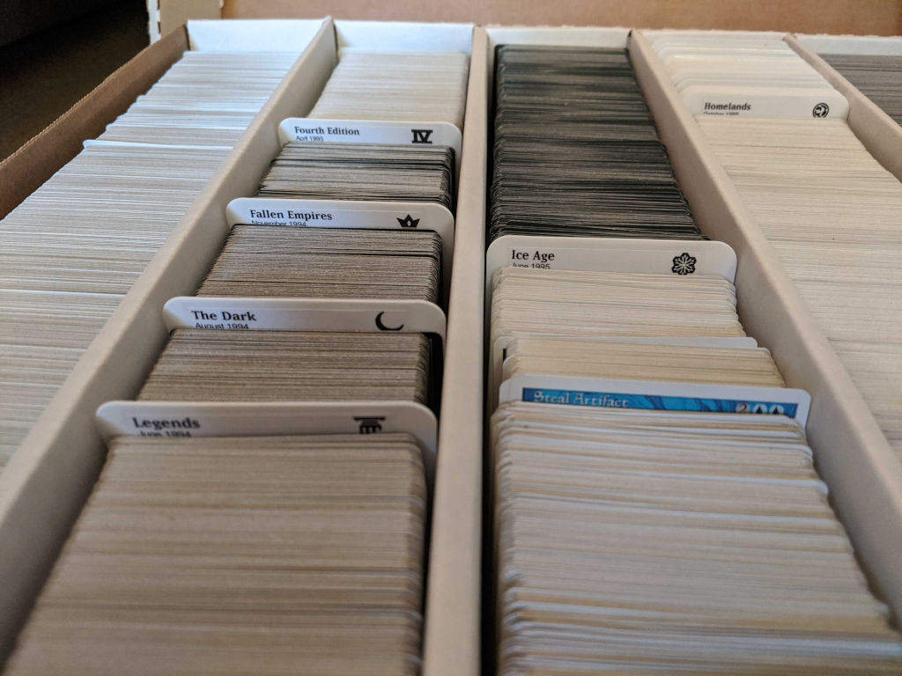
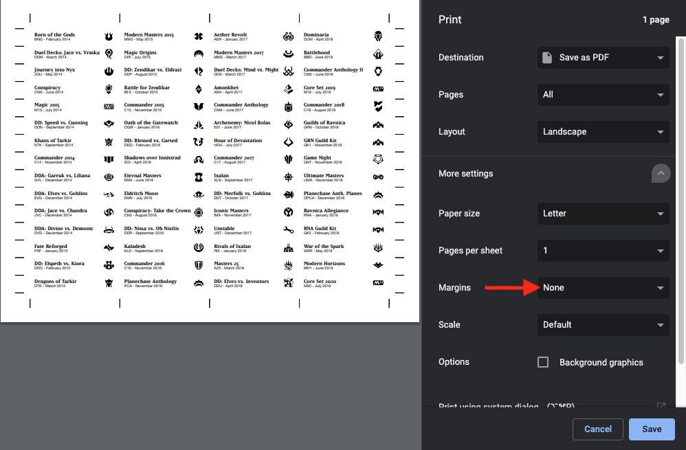

Magic: the Gathering Printable Set Label Generator
==================================================

This is a small script for generating Magic: the Gathering (MTG) printable set labels
in order to organize a collection of cards.
The code is powered by the [Scryfall API][scryfall-api].
As soon as a new set is up on Scryfall,
the label for that set can be generated and printed.

* Print and cut out the labels
* Attach set labels to [plastic dividers][plastic-dividers]

[scryfall-api]: https://scryfall.com/docs/api/sets
[plastic-dividers]: https://www.amazon.com/dp/B00S3FF1PI/

## Usage

If you're just interested in downloading and printing these set labels,
check out the [web frontend](https://mtg-label-generator.fly.dev/)
([code](https://github.com/davidfischer/mtg-printable-set-label-frontend))
and generate your own labels.

### Advanced

If you want to further customize things, read on!

The script `generator.py` is a small Python script to generate the printable labels.
It requires Python 3.6+ and has a few dependencies.

    pip install -r requirements.txt  # Install dependencies
    python mtglabels/generator.py        # Creates SVG & PDF files in output/

By default, this will create SVG & PDF files.
The SVG files are vector image files that can be customized further.
The PDF files are ready to print.

The SVGs use the free fonts [EB Garamond][garamond] bold and [Source Sans Pro][source-sans] regular.

[garamond]: https://fonts.google.com/specimen/EB+Garamond
[source-sans]: https://fonts.google.com/specimen/Source+Sans+Pro

### Customizing

A lot of features can be customized by changing constants at the top of `generator.py`.
For example, sets can be excluded one-by-one or in groups by type or sets can be renamed.

The labels are designed for US Letter paper but this can be customized:

    python mtglabels/generator.py --paper-size=a4   # Use A4 paper size
    python mtglabels/generator.py --help   # Show all options

You can generate labels for specific sets as well:

    python mtglabels/generator.py lea mh1 mh2 neo

You can change how the labels are actually displayed and rendered by customizing `templates/labels.svg`.
If you change the fonts, you may also need to resize things to fit.

### Tips for printing SVGs

If you're just using the default PDFs, you probably won't need this.
However, if you are customizing the SVGs and printing them, this section is for you.

The output SVGs are precisely sized for a sheet of paper (US Letter by default).
Make sure while printing in your browser or otherwise to set the margins to None.

You can also "print" to a PDF.

## License

The code is available at [GitHub][home] under the [MIT license][license].

Some data such as set icons are unofficial Fan Content permitted under the Wizards of the Coast Fan Content Policy
and is copyright Wizards of the Coast, LLC, a subsidiary of Hasbro, Inc.
This code is not produced by, endorsed by, supported by, or affiliated with Wizards of the Coast.

[home]: https://github.com/davidfischer/mtg-printable-set-label-generator
[license]: https://opensource.org/licenses/MIT

## Credits

Special thanks goes to the users behind other printable set labels
such as those found [here][previous-set-labels].
Using these fantastic labels definitely provided inspiration and direction
and made me want something more customizable and updatable.

[previous-set-labels]: https://github.com/xsilium/MTG-Printable-Labels
